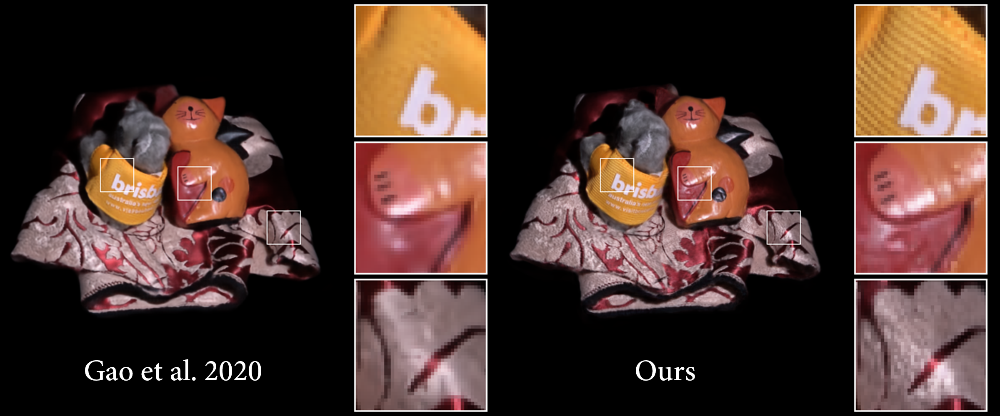

# 
 A Multi-Resolution Network Architecture for Deferred Neural Lighting 

 Shengjie Ma1,2, Hongzhi Wu1,2, Zhong Ren1,2, Kun Zhou1,2* 
  

 1State Key Lab of CAD&CG, Zhejiang University, China; 
  

 2ZJU-FaceUnity Joint Lab of Intelligent Graphics, China. 
  

### Abstruct

 We present a novel multi-resolution network architecture for deferred neural lighting. The key idea is to explicitly separate the processing of appearance at different spatial resolutions, leading to considerably improved high-frequency details as well as temporal stability in animation sequences with varying view conditions. Moreover, our network is only half the size of the original one, and requires less training data to converge to satisfactory results. The network is tested over five captured datasets from deferred neural lighting and may be extended to other neural appearance techniques, such as NeRF or neural textures. 

### Download urls
[Supplementary video](./casa3_full.mp4)
